:::::::::::::::::::::::::::::::::::::: questions

- How do I create charts in R that look better than SPSS Chart Builder output?
- What is the ggplot2 "grammar of graphics" approach?
- How do I customize colors, labels, and themes?

::::::::::::::::::::::::::::::::::::::::::::::::

::::::::::::::::::::::::::::::::::::: objectives

- Build bar charts, histograms, scatterplots, and line charts with ggplot2
- Customize plots with labels, colors, and themes for publication quality
- Compare ggplot2 output with SPSS Chart Builder equivalents
- Create faceted plots to compare groups

::::::::::::::::::::::::::::::::::::::::::::::::

{alt="Cartoon of a researcher painting a ggplot2 chart that captures the Caribbean sunset and flamingos"}

## The grammar of graphics

In SPSS, you create charts through the **Chart Builder** dialog: you drag variables
onto axes, pick a chart type, and click OK. The result is a finished chart, but
customizing it requires clicking through many menus.

ggplot2 takes a fundamentally different approach called the **grammar of graphics**.
Instead of picking a finished chart type, you build a plot layer by layer, like
constructing a sentence:

1. **Data** --- what data frame are you plotting?
2. **Aesthetics** (`aes()`) --- which variables map to the x-axis, y-axis, color, size, etc.?
3. **Geometry** (`geom_*()`) --- what visual marks represent the data (bars, points, lines)?
4. **Labels** (`labs()`) --- what titles and axis labels should appear?
5. **Theme** (`theme_*()`) --- what overall style should the plot have?

You combine these layers with the `+` operator. Let's see how this works in
practice. First, let's load our packages and data:


``` r
library(tidyverse)

visitors <- read_csv("data/aruba_visitors.csv")
```

Here is the simplest possible ggplot call --- just the data and aesthetics, with
no geometry yet:


``` r
ggplot(data = visitors, aes(x = origin, y = visitors_stayover))
```

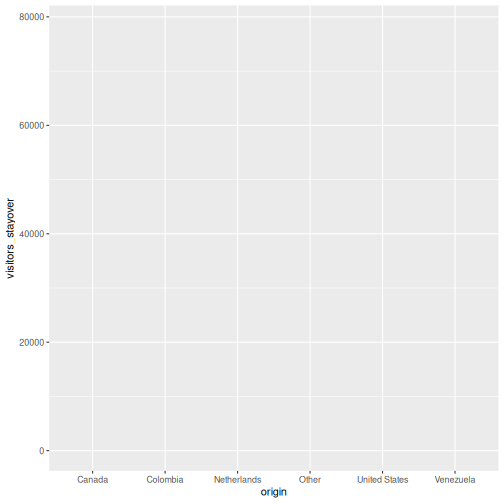

This gives us an empty canvas with axes. Now we add a geometry layer:


``` r
ggplot(data = visitors, aes(x = origin, y = visitors_stayover)) +
  geom_col()
```

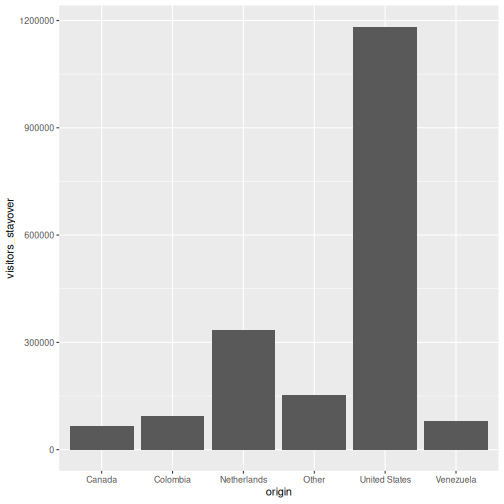

That is already a bar chart. The `+` operator is how you add layers --- think of
it as stacking transparencies on top of each other.

::::::::::::::::::::::::::::::::::::: callout

## The `+` operator vs. the pipe `|>`

The pipe `|>` passes data *into* a function. The `+` in ggplot2 *adds layers*
to a plot. They look similar but do different things. A common beginner mistake
is using `|>` where `+` is needed:
```r
# WRONG --- this will produce an error
ggplot(visitors, aes(x = origin)) |> geom_bar()

# CORRECT
ggplot(visitors, aes(x = origin)) + geom_bar()
```

::::::::::::::::::::::::::::::::::::::::::::::::

## Common chart types

Below is a reference table mapping SPSS Chart Builder chart types to their
ggplot2 equivalents:

| Chart type   | SPSS menu path                          | ggplot2 geometry       |
|--------------|-----------------------------------------|------------------------|
| Bar chart    | Graphs > Chart Builder > Bar            | `geom_bar()` / `geom_col()` |
| Histogram    | Graphs > Chart Builder > Histogram      | `geom_histogram()`     |
| Scatterplot  | Graphs > Chart Builder > Scatter/Dot    | `geom_point()`         |
| Line chart   | Graphs > Chart Builder > Line           | `geom_line()`          |
| Boxplot      | Graphs > Chart Builder > Boxplot        | `geom_boxplot()`       |

Let's work through each one using the Aruba visitors data.

### Bar chart: `geom_bar()` and `geom_col()`

There are two bar chart geoms. Use `geom_bar()` when you want R to **count rows**
for you, and `geom_col()` when you already have the **values to plot**.


``` r
# geom_bar() counts the rows per origin (6 origins x 20 quarters = 20 rows each)
ggplot(visitors, aes(x = origin)) +
  geom_bar()
```

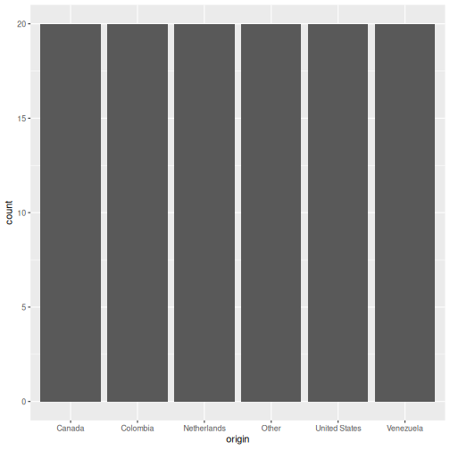


``` r
# geom_col() uses a pre-computed value on the y-axis
visitors_total <- visitors |>
  group_by(origin) |>
  summarise(total_stayover = sum(visitors_stayover))

ggplot(visitors_total, aes(x = reorder(origin, -total_stayover),
                            y = total_stayover)) +
  geom_col()
```

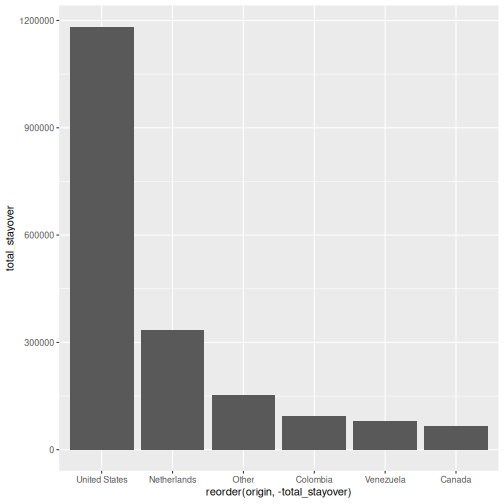

::::::::::::::::::::::::::::::::::::: callout

## `geom_bar()` vs. `geom_col()` --- when to use which?

- `geom_bar()` uses `stat = "count"` by default: it counts how many rows fall
  into each category. You only need an `x` aesthetic.
- `geom_col()` uses `stat = "identity"`: it plots the actual value you supply.
  You need both `x` and `y`.

In SPSS Chart Builder, when you drag a categorical variable to the x-axis and a
scale variable to the y-axis with "Mean" as the summary, that is equivalent to
first computing the mean with `summarise()` and then using `geom_col()`.

::::::::::::::::::::::::::::::::::::::::::::::::

### Histogram: `geom_histogram()`

In SPSS: **Graphs > Chart Builder**, drag a scale variable to the x-axis and
select the Histogram type.


``` r
ggplot(visitors, aes(x = avg_spending_usd)) +
  geom_histogram(binwidth = 50, color = "white")
```

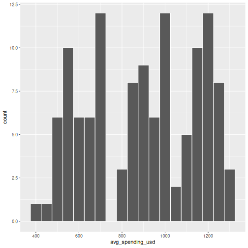

The `binwidth` argument controls how wide each bin is. Experiment with different
values to see how the shape of the distribution changes.

### Scatterplot: `geom_point()`

In SPSS: **Graphs > Chart Builder**, drag variables to x and y axes and select
Simple Scatter.


``` r
ggplot(visitors, aes(x = avg_spending_usd, y = satisfaction_score)) +
  geom_point()
```

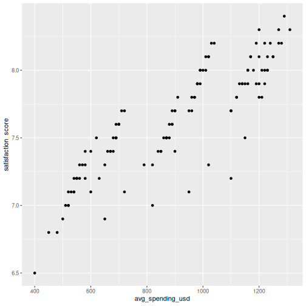

You can map additional variables to aesthetics like color and size:


``` r
ggplot(visitors, aes(x = avg_spending_usd, y = satisfaction_score,
                     color = origin)) +
  geom_point(size = 2, alpha = 0.7)
```

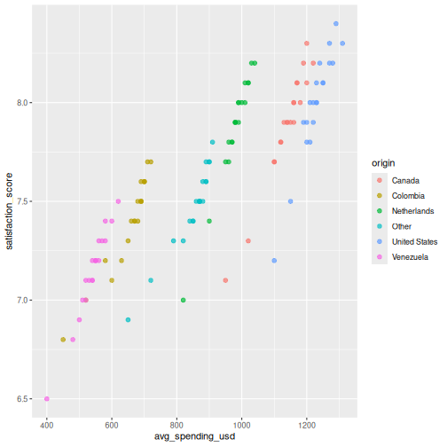

### Line chart: `geom_line()`

Line charts are great for showing trends over time. Let's compute quarterly
totals and plot them:


``` r
quarterly_totals <- visitors |>
  group_by(year, quarter) |>
  summarise(total_stayover = sum(visitors_stayover), .groups = "drop") |>
  mutate(date_label = paste(year, quarter, sep = "-"))

ggplot(quarterly_totals, aes(x = date_label, y = total_stayover, group = 1)) +
  geom_line() +
  geom_point()
```

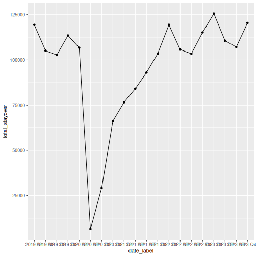

That works, but the x-axis labels overlap. Let's also see how to plot multiple
lines by origin:


``` r
visitors_by_qtr <- visitors |>
  mutate(date_label = paste(year, quarter, sep = "-"))

ggplot(visitors_by_qtr, aes(x = date_label, y = visitors_stayover,
                             color = origin, group = origin)) +
  geom_line() +
  theme(axis.text.x = element_text(angle = 45, hjust = 1))
```

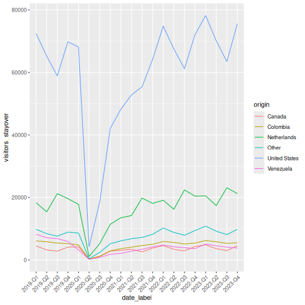

### Boxplot: `geom_boxplot()`

In SPSS: **Graphs > Chart Builder**, select Boxplot and drag a grouping variable
to the x-axis and a scale variable to the y-axis.


``` r
ggplot(visitors, aes(x = origin, y = avg_spending_usd)) +
  geom_boxplot()
```

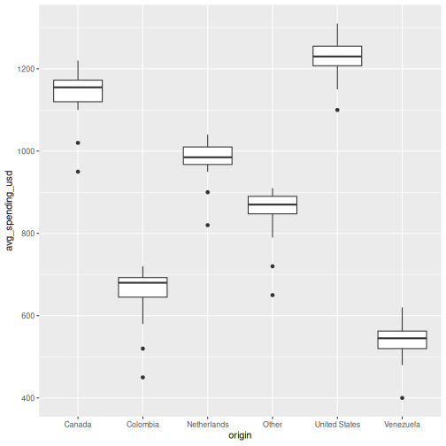

## Making it publication-ready

So far our plots have been functional but plain. Let's take a bar chart through
the full journey from basic to polished. This is where ggplot2 truly outshines
SPSS Chart Builder --- every tweak is a single line of code.

**Step 1: Basic chart**


``` r
p <- ggplot(visitors_total, aes(x = reorder(origin, -total_stayover),
                                 y = total_stayover)) +
  geom_col()
p
```


**Step 2: Add labels**


``` r
p <- p +
  labs(
    title = "Stayover Visitors to Aruba by Origin Country",
    subtitle = "Total visitors, 2019--2023",
    x = "Country of Origin",
    y = "Total Stayover Visitors",
    caption = "Source: Aruba visitors dataset"
  )
p
```

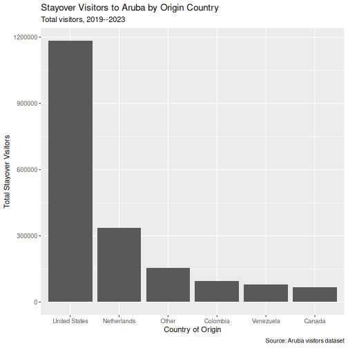

**Step 3: Apply a clean theme**


``` r
p <- p + theme_minimal()
p
```

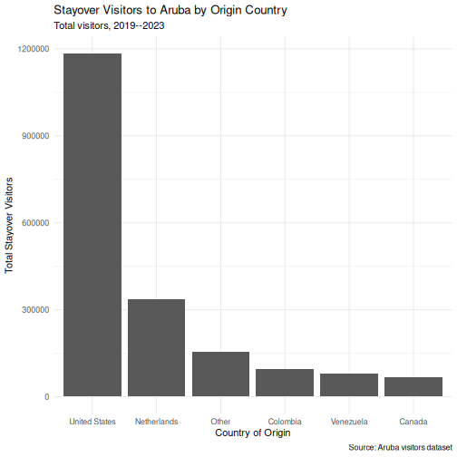

**Step 4: Customize colors**


``` r
p <- p +
  geom_col(fill = "#2a9d8f") +
  theme_minimal(base_size = 13)
p
```

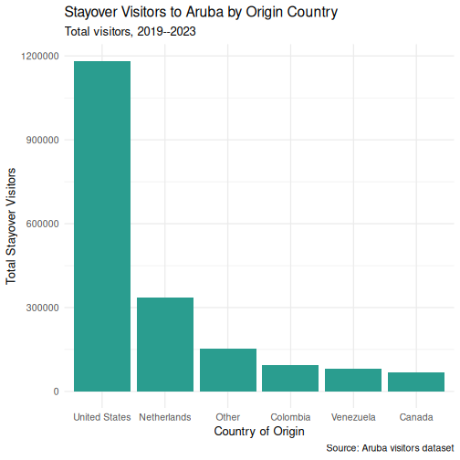

**Step 5: Fine-tune text and formatting**


``` r
p <- p +
  scale_y_continuous(labels = scales::comma) +
  theme(
    plot.title = element_text(face = "bold"),
    axis.text.x = element_text(angle = 30, hjust = 1)
  )
p
```

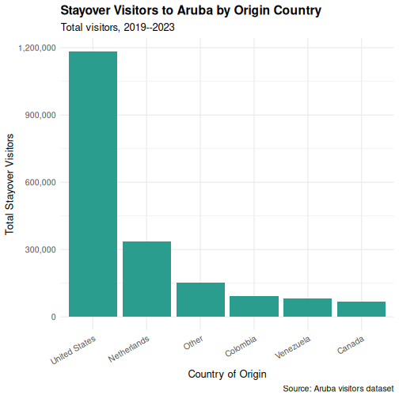

::::::::::::::::::::::::::::::::::::: callout

## Saving your plot

Use `ggsave()` to export your plot as a PNG, PDF, or SVG file:

```r
ggsave("my_plot.png", plot = p, width = 8, height = 5, dpi = 300)
```

In SPSS you right-click the chart and choose Export --- `ggsave()` gives you
precise control over dimensions and resolution, which is exactly what journals
require.

::::::::::::::::::::::::::::::::::::::::::::::::

## Faceting: small multiples

Faceting is one of ggplot2's most powerful features and something SPSS Chart
Builder handles poorly. Instead of cramming all groups onto one chart, you split
the data into panels --- one per group.


``` r
visitors_annual <- visitors |>
  group_by(year, origin) |>
  summarise(total_stayover = sum(visitors_stayover), .groups = "drop")

ggplot(visitors_annual, aes(x = year, y = total_stayover)) +
  geom_line() +
  geom_point() +
  facet_wrap(~ origin, scales = "free_y") +
  labs(
    title = "Annual Stayover Visitors by Origin",
    x = "Year",
    y = "Total Stayover Visitors"
  ) +
  scale_y_continuous(labels = scales::comma) +
  theme_minimal()
```

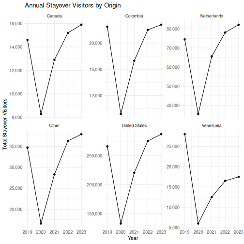

The `scales = "free_y"` argument lets each panel have its own y-axis range. This
is important when groups have very different magnitudes (e.g., US visitors vastly
outnumber Canadian visitors).

:::::::::::::::::::::::::::::::::::::::::::: instructor

## Instructor note

The faceting example is a great place to pause and let learners experiment.
Encourage them to try:

- `facet_wrap(~ origin, ncol = 2)` to control the layout
- `facet_grid(origin ~ .)` for a grid arrangement
- removing `scales = "free_y"` to see the difference

::::::::::::::::::::::::::::::::::::::::::::::::::::::::

::::::::::::::::::::::::::::::::::::: challenge

## Challenge 1: Build a publication-quality faceted chart

Using the `visitors` data, create a scatterplot of `avg_spending_usd` (x-axis)
vs. `satisfaction_score` (y-axis), with the following requirements:

1. Color the points by `origin`
2. Add a linear trend line using `geom_smooth(method = "lm")`
3. Facet by `year`
4. Add a proper title, axis labels, and caption
5. Use `theme_minimal()` and make the title bold

:::::::::::::::::::::::: solution

## Solution


``` r
ggplot(visitors, aes(x = avg_spending_usd, y = satisfaction_score,
                     color = origin)) +
  geom_point(alpha = 0.7, size = 2) +
  geom_smooth(method = "lm", se = FALSE, linewidth = 0.8) +
  facet_wrap(~ year) +
  labs(
    title = "Spending vs. Satisfaction by Origin Country",
    subtitle = "Each panel represents one year (2019--2023)",
    x = "Average Spending (USD)",
    y = "Satisfaction Score (1--10)",
    color = "Origin",
    caption = "Source: Aruba visitors dataset"
  ) +
  theme_minimal(base_size = 12) +
  theme(
    plot.title = element_text(face = "bold"),
    legend.position = "bottom"
  )
```

``` output
`geom_smooth()` using formula = 'y ~ x'
```

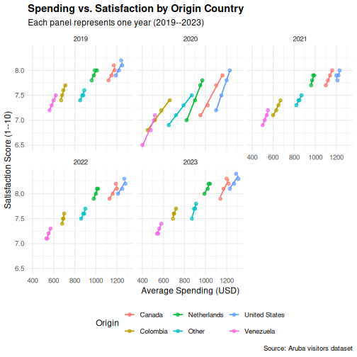

:::::::::::::::::::::::::::::::::
::::::::::::::::::::::::::::::::::::::::::::::::

::::::::::::::::::::::::::::::::::::: challenge

## Challenge 2: Recreate an SPSS-style chart

In SPSS, a common chart is a clustered bar chart showing means by group. Create
the R equivalent: a bar chart showing **mean stay-over visitors per quarter** for
each origin country, with bars colored by origin. Add error bars using
`stat_summary()`.

*Hint:* You can use `stat_summary(fun = mean, geom = "col")` to compute the
mean within the plot itself, without pre-computing it.

:::::::::::::::::::::::: solution

## Solution


``` r
ggplot(visitors, aes(x = origin, y = visitors_stayover, fill = origin)) +
  stat_summary(fun = mean, geom = "col", width = 0.7) +
  stat_summary(fun.data = mean_se, geom = "errorbar", width = 0.3) +
  labs(
    title = "Mean Quarterly Stayover Visitors by Origin",
    x = "Country of Origin",
    y = "Mean Stayover Visitors per Quarter"
  ) +
  scale_y_continuous(labels = scales::comma) +
  theme_minimal(base_size = 12) +
  theme(
    plot.title = element_text(face = "bold"),
    axis.text.x = element_text(angle = 30, hjust = 1),
    legend.position = "none"
  )
```

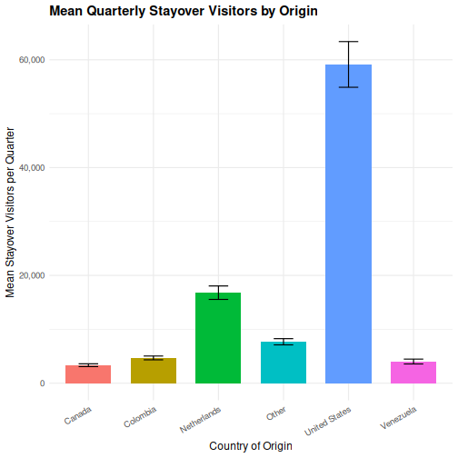

:::::::::::::::::::::::::::::::::
::::::::::::::::::::::::::::::::::::::::::::::::

::::::::::::::::::::::::::::::::::::: keypoints

- ggplot2 builds plots in layers: data, aesthetics, geometry, labels, theme
- Every SPSS Chart Builder chart has a ggplot2 equivalent that offers more control
- Faceting (`facet_wrap`) lets you create small multiples --- something SPSS Chart Builder handles poorly

::::::::::::::::::::::::::::::::::::::::::::::::
