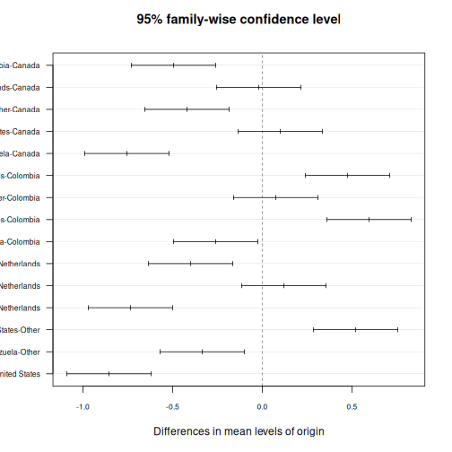
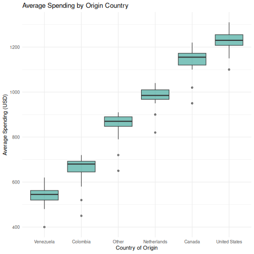
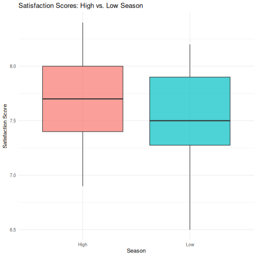
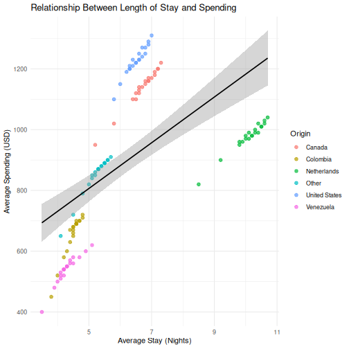

:::::::::::::::::::::::::::::::::::::: questions

- How do I run t-tests, ANOVA, correlations, and regression in R?
- How does R output compare to SPSS output tables?
- How do I extract and report results?

::::::::::::::::::::::::::::::::::::::::::::::::

::::::::::::::::::::::::::::::::::::: objectives

- Run independent and paired samples t-tests
- Conduct one-way ANOVA with post-hoc tests
- Calculate correlations and run simple linear regression
- Interpret R output by mapping it to familiar SPSS output tables

::::::::::::::::::::::::::::::::::::::::::::::::

{alt="Cartoon of a researcher as a beach detective following a regression line in the sand while crabs carry p-values on their shells"}

## From SPSS dialogs to R functions

In SPSS, every statistical test lives behind a menu: **Analyze > Compare Means**,
**Analyze > Correlate**, and so on. In R, each test is a single function call. The
table below maps the SPSS dialogs you already know to their R equivalents:

| Analysis                     | SPSS menu path                                         | R function                                  |
|------------------------------|--------------------------------------------------------|---------------------------------------------|
| Independent-samples t-test   | Analyze > Compare Means > Independent-Samples T Test   | `t.test(y ~ group, data = df)`              |
| Paired-samples t-test        | Analyze > Compare Means > Paired-Samples T Test        | `t.test(x, y, paired = TRUE)`               |
| One-way ANOVA                | Analyze > Compare Means > One-Way ANOVA                | `aov(y ~ group, data = df)` + `summary()`   |
| Post-hoc tests               | (checkbox in ANOVA dialog)                             | `TukeyHSD()`                                |
| Bivariate correlation        | Analyze > Correlate > Bivariate                        | `cor.test(df$x, df$y)`                      |
| Linear regression            | Analyze > Regression > Linear                          | `lm(y ~ x1 + x2, data = df)` + `summary()` |

Let's load our data and packages:


``` r
library(tidyverse)
library(broom)

visitors <- read_csv("data/aruba_visitors.csv")
```

### T-tests

#### Independent-samples t-test

In SPSS, you would go to **Analyze > Compare Means > Independent-Samples T
Test**, move your test variable to the "Test Variable(s)" box, move your grouping
variable to the "Grouping Variable" box, and define the two groups.

In R, it is one line. Let's test whether the average spending differs between
US and Netherlands visitors:


``` r
# Filter to just the two groups we want to compare
us_nl <- visitors |>
  filter(origin %in% c("United States", "Netherlands"))

# Run the independent-samples t-test
t_result <- t.test(avg_spending_usd ~ origin, data = us_nl)
t_result
```

``` output

	Welch Two Sample t-test

data:  avg_spending_usd by origin
t = -16.195, df = 37.99, p-value < 2.2e-16
alternative hypothesis: true difference in means between group Netherlands and group United States is not equal to 0
95 percent confidence interval:
 -280.1256 -217.8744
sample estimates:
  mean in group Netherlands mean in group United States 
                      978.5                      1227.5 
```

::::::::::::::::::::::::::::::::::::: callout

## Reading the t-test output --- SPSS comparison

The R output gives you the same information as the SPSS "Independent Samples
Test" table, just arranged differently:

| SPSS output column          | R output line                           |
|-----------------------------|-----------------------------------------|
| t                           | `t = ...`                               |
| df                          | `df = ...`                              |
| Sig. (2-tailed)             | `p-value = ...`                         |
| Mean Difference             | difference in means shown in estimates  |
| 95% CI of the Difference    | `95 percent confidence interval:`       |

The key difference: SPSS shows Levene's test for equality of variances
automatically. R's `t.test()` uses the Welch correction by default (which does
**not** assume equal variances). This is actually the better default --- many
statisticians recommend always using the Welch t-test.

If you need the equal-variances version (the "Equal variances assumed" row in
SPSS), add `var.equal = TRUE`:

```r
t.test(avg_spending_usd ~ origin, data = us_nl, var.equal = TRUE)
```

::::::::::::::::::::::::::::::::::::::::::::::::

#### Paired-samples t-test

A paired t-test compares two measurements on the same cases. Let's compare Q1
vs. Q3 hotel occupancy rates (the same hotels measured in different quarters):


``` r
# Get Q1 and Q3 data for each year
q1_data <- visitors |>
  filter(quarter == "Q1") |>
  arrange(year, origin) |>
  pull(hotel_occupancy_pct)

q3_data <- visitors |>
  filter(quarter == "Q3") |>
  arrange(year, origin) |>
  pull(hotel_occupancy_pct)

# Paired t-test
t.test(q1_data, q3_data, paired = TRUE)
```

``` output

	Paired t-test

data:  q1_data and q3_data
t = 3.6602, df = 29, p-value = 0.000998
alternative hypothesis: true mean difference is not equal to 0
95 percent confidence interval:
  4.941648 17.458352
sample estimates:
mean difference 
           11.2 
```

In SPSS this would be **Analyze > Compare Means > Paired-Samples T Test**,
where you select the two variables as a pair.

### ANOVA

#### One-way ANOVA

In SPSS: **Analyze > Compare Means > One-Way ANOVA**. Move the dependent
variable to the "Dependent List" and the factor to "Factor".

Let's test whether satisfaction scores differ across origin countries:


``` r
# Fit the ANOVA model
anova_model <- aov(satisfaction_score ~ origin, data = visitors)

# View the ANOVA table
summary(anova_model)
```

``` output
             Df Sum Sq Mean Sq F value Pr(>F)    
origin        5 11.610  2.3220   35.28 <2e-16 ***
Residuals   114  7.502  0.0658                   
---
Signif. codes:  0 '***' 0.001 '**' 0.01 '*' 0.05 '.' 0.1 ' ' 1
```

::::::::::::::::::::::::::::::::::::: callout

## Reading the ANOVA table --- SPSS comparison

| SPSS output column | R output column |
|--------------------|-----------------|
| Sum of Squares     | `Sum Sq`        |
| df                 | `Df`            |
| Mean Square        | `Mean Sq`       |
| F                  | `F value`       |
| Sig.               | `Pr(>F)`        |

The layout is almost identical --- R just uses slightly different column names.

::::::::::::::::::::::::::::::::::::::::::::::::

#### Post-hoc tests with TukeyHSD

If the ANOVA is significant, you want to know *which* groups differ. In SPSS,
you check the "Post Hoc" button in the ANOVA dialog and select Tukey. In R:


``` r
TukeyHSD(anova_model)
```

``` output
  Tukey multiple comparisons of means
    95% family-wise confidence level

Fit: aov(formula = satisfaction_score ~ origin, data = visitors)

$origin
                            diff        lwr         upr     p adj
Colombia-Canada           -0.495 -0.7301532 -0.25984681 0.0000002
Netherlands-Canada        -0.020 -0.2551532  0.21515319 0.9998728
Other-Canada              -0.420 -0.6551532 -0.18484681 0.0000143
United States-Canada       0.100 -0.1351532  0.33515319 0.8199046
Venezuela-Canada          -0.755 -0.9901532 -0.51984681 0.0000000
Netherlands-Colombia       0.475  0.2398468  0.71015319 0.0000007
Other-Colombia             0.075 -0.1601532  0.31015319 0.9394347
United States-Colombia     0.595  0.3598468  0.83015319 0.0000000
Venezuela-Colombia        -0.260 -0.4951532 -0.02484681 0.0211495
Other-Netherlands         -0.400 -0.6351532 -0.16484681 0.0000408
United States-Netherlands  0.120 -0.1151532  0.35515319 0.6781085
Venezuela-Netherlands     -0.735 -0.9701532 -0.49984681 0.0000000
United States-Other        0.520  0.2848468  0.75515319 0.0000001
Venezuela-Other           -0.335 -0.5701532 -0.09984681 0.0009635
Venezuela-United States   -0.855 -1.0901532 -0.61984681 0.0000000
```

This gives you pairwise comparisons with adjusted p-values, the difference in
means, and 95% confidence intervals --- the same information as the SPSS
"Multiple Comparisons" table.

You can also visualize the post-hoc results:


``` r
plot(TukeyHSD(anova_model), las = 1, cex.axis = 0.7)
```



### Correlation

In SPSS: **Analyze > Correlate > Bivariate**. Move variables to the "Variables"
box and select Pearson, Spearman, or both.

Let's test the correlation between average spending and satisfaction:


``` r
cor.test(visitors$avg_spending_usd, visitors$satisfaction_score)
```

``` output

	Pearson's product-moment correlation

data:  visitors$avg_spending_usd and visitors$satisfaction_score
t = 18.69, df = 118, p-value < 2.2e-16
alternative hypothesis: true correlation is not equal to 0
95 percent confidence interval:
 0.8110127 0.9037614
sample estimates:
      cor 
0.8645736 
```

::::::::::::::::::::::::::::::::::::: callout

## Reading correlation output --- SPSS comparison

| SPSS output                  | R output                         |
|------------------------------|----------------------------------|
| Pearson Correlation          | `cor` (the estimate at the end)  |
| Sig. (2-tailed)              | `p-value`                        |
| N                            | shown in the data, not in output |
| 95% CI                       | `95 percent confidence interval` |

One advantage of R: `cor.test()` gives you a confidence interval for the
correlation by default. SPSS does not show this unless you use syntax.

::::::::::::::::::::::::::::::::::::::::::::::::

For a correlation matrix of multiple variables (like the SPSS correlation table),
use `cor()`:


``` r
visitors |>
  select(visitors_stayover, avg_stay_nights, avg_spending_usd,
         hotel_occupancy_pct, satisfaction_score) |>
  cor(use = "complete.obs") |>
  round(3)
```

``` output
                    visitors_stayover avg_stay_nights avg_spending_usd
visitors_stayover               1.000           0.276            0.622
avg_stay_nights                 0.276           1.000            0.597
avg_spending_usd                0.622           0.597            1.000
hotel_occupancy_pct             0.231           0.166            0.206
satisfaction_score              0.589           0.674            0.865
                    hotel_occupancy_pct satisfaction_score
visitors_stayover                 0.231              0.589
avg_stay_nights                   0.166              0.674
avg_spending_usd                  0.206              0.865
hotel_occupancy_pct               1.000              0.575
satisfaction_score                0.575              1.000
```

### Linear regression

In SPSS: **Analyze > Regression > Linear**. Move the dependent variable to
"Dependent" and independent variables to "Independent(s)".

Let's predict average spending from stay nights and origin country:


``` r
reg_model <- lm(avg_spending_usd ~ avg_stay_nights + origin, data = visitors)
summary(reg_model)
```

``` output

Call:
lm(formula = avg_spending_usd ~ avg_stay_nights + origin, data = visitors)

Residuals:
     Min       1Q   Median       3Q      Max 
-112.239   -7.704    2.216   12.417   58.083 

Coefficients:
                    Estimate Std. Error t value Pr(>|t|)    
(Intercept)          234.210     33.037   7.089 1.24e-10 ***
avg_stay_nights      134.943      4.879  27.659  < 2e-16 ***
originColombia      -184.753     12.670 -14.582  < 2e-16 ***
originNetherlands   -619.305     17.829 -34.737  < 2e-16 ***
originOther          -88.610      9.756  -9.082 4.05e-15 ***
originUnited States  114.139      6.600  17.294  < 2e-16 ***
originVenezuela     -273.788     13.452 -20.354  < 2e-16 ***
---
Signif. codes:  0 '***' 0.001 '**' 0.01 '*' 0.05 '.' 0.1 ' ' 1

Residual standard error: 20.66 on 113 degrees of freedom
Multiple R-squared:  0.9937,	Adjusted R-squared:  0.9933 
F-statistic:  2962 on 6 and 113 DF,  p-value: < 2.2e-16
```

::::::::::::::::::::::::::::::::::::: callout

## Reading regression output --- SPSS comparison

The `summary()` output contains everything from the SPSS regression output
tables, but in a more compact format:

| SPSS table            | R output section                     |
|-----------------------|--------------------------------------|
| Model Summary (R-sq)  | `Multiple R-squared`, `Adjusted R-squared` at the bottom |
| ANOVA table (F-test)  | `F-statistic` at the very bottom     |
| Coefficients table    | The `Coefficients:` section          |
| B (unstandardized)    | `Estimate` column                    |
| Std. Error            | `Std. Error` column                  |
| t                     | `t value` column                     |
| Sig.                  | `Pr(>|t|)` column                    |

Note: R does **not** give you standardized coefficients (Beta) by default. To
get those, scale your variables first with `scale()`, or use the `lm.beta`
package.

::::::::::::::::::::::::::::::::::::::::::::::::

## Reading R output with `broom::tidy()`

The raw R output is fine for interactive exploration, but it is hard to export
or combine with other results. The `broom` package converts statistical output
into tidy data frames --- one row per term, columns for estimate, standard
error, test statistic, and p-value.


``` r
# Tidy the t-test result
tidy(t_result)
```

``` output
# A tibble: 1 × 10
  estimate estimate1 estimate2 statistic  p.value parameter conf.low conf.high
     <dbl>     <dbl>     <dbl>     <dbl>    <dbl>     <dbl>    <dbl>     <dbl>
1     -249      978.     1228.     -16.2 1.21e-18      38.0    -280.     -218.
# ℹ 2 more variables: method <chr>, alternative <chr>
```


``` r
# Tidy the regression coefficients
tidy(reg_model)
```

``` output
# A tibble: 7 × 5
  term                estimate std.error statistic  p.value
  <chr>                  <dbl>     <dbl>     <dbl>    <dbl>
1 (Intercept)            234.      33.0       7.09 1.24e-10
2 avg_stay_nights        135.       4.88     27.7  3.93e-52
3 originColombia        -185.      12.7     -14.6  9.90e-28
4 originNetherlands     -619.      17.8     -34.7  3.86e-62
5 originOther            -88.6      9.76     -9.08 4.05e-15
6 originUnited States    114.       6.60     17.3  1.56e-33
7 originVenezuela       -274.      13.5     -20.4  1.35e-39
```


``` r
# Get model-level statistics (R-squared, F, etc.)
glance(reg_model)
```

``` output
# A tibble: 1 × 12
  r.squared adj.r.squared sigma statistic   p.value    df logLik   AIC   BIC
      <dbl>         <dbl> <dbl>     <dbl>     <dbl> <dbl>  <dbl> <dbl> <dbl>
1     0.994         0.993  20.7     2962. 8.91e-122     6  -530. 1076. 1098.
# ℹ 3 more variables: deviance <dbl>, df.residual <int>, nobs <int>
```

The `tidy()` output is a regular data frame, which means you can filter it,
arrange it, or export it to CSV --- something that is surprisingly difficult
with SPSS output. This is extremely useful for reporting: you can extract
exactly the numbers you need and drop them into a table or a plot.

:::::::::::::::::::::::::::::::::::::::::::: instructor

## Instructor note

This is a good time to reinforce the reproducibility advantage. In SPSS, if a
reviewer asks you to re-run an analysis with a different subset, you have to
click through the dialogs again. In R, you change one line of code and re-run
the script.

Emphasize that `broom::tidy()` produces a data frame --- this means students
can use all the dplyr verbs they learned in Episode 3 on their statistical
results (filtering significant results, arranging by p-value, etc.).

::::::::::::::::::::::::::::::::::::::::::::::::::::::::

## A complete analysis workflow

Let's put everything together in a workflow that mirrors what you would do in
SPSS, but entirely in code. Our research question: **Does average spending
differ by origin country, and what predicts higher spending?**


``` r
# Step 1: Descriptive statistics by group
visitors |>
  group_by(origin) |>
  summarise(
    n = n(),
    mean_spending = mean(avg_spending_usd),
    sd_spending = sd(avg_spending_usd),
    mean_satisfaction = mean(satisfaction_score)
  ) |>
  arrange(desc(mean_spending))
```

``` output
# A tibble: 6 × 5
  origin            n mean_spending sd_spending mean_satisfaction
  <chr>         <int>         <dbl>       <dbl>             <dbl>
1 United States    20         1228.        48.2              8.00
2 Canada           20         1139         63.0              7.90
3 Netherlands      20          978.        49.0              7.88
4 Other            20          850         64.2              7.48
5 Colombia         20          654         68.6              7.4 
6 Venezuela        20          540         46.9              7.14
```


``` r
# Step 2: Visualize the distribution
ggplot(visitors, aes(x = reorder(origin, avg_spending_usd, FUN = median),
                     y = avg_spending_usd)) +
  geom_boxplot(fill = "#2a9d8f", alpha = 0.6) +
  labs(title = "Average Spending by Origin Country",
       x = "Country of Origin",
       y = "Average Spending (USD)") +
  theme_minimal()
```




``` r
# Step 3: ANOVA --- is there a significant difference?
spending_anova <- aov(avg_spending_usd ~ origin, data = visitors)
summary(spending_anova)
```

``` output
             Df  Sum Sq Mean Sq F value Pr(>F)    
origin        5 7262707 1452541   441.7 <2e-16 ***
Residuals   114  374890    3289                   
---
Signif. codes:  0 '***' 0.001 '**' 0.01 '*' 0.05 '.' 0.1 ' ' 1
```


``` r
# Step 4: Post-hoc --- which groups differ?
tukey_results <- TukeyHSD(spending_anova)
tidy(tukey_results) |>
  filter(adj.p.value < 0.05) |>
  arrange(adj.p.value)
```

``` output
# A tibble: 15 × 7
   term   contrast            null.value estimate conf.low conf.high adj.p.value
   <chr>  <chr>                    <dbl>    <dbl>    <dbl>     <dbl>       <dbl>
 1 origin Colombia-Canada              0   -485     -538.     -432.     2.43e-14
 2 origin Other-Canada                 0   -289     -342.     -236.     2.43e-14
 3 origin Venezuela-Canada             0   -599     -652.     -546.     2.43e-14
 4 origin Netherlands-Colomb…          0    324.     272.      377.     2.43e-14
 5 origin United States-Colo…          0    573.     521.      626.     2.43e-14
 6 origin United States-Neth…          0    249      196.      302.     2.43e-14
 7 origin Venezuela-Netherla…          0   -438.    -491.     -386.     2.43e-14
 8 origin United States-Other          0    377.     325.      430.     2.43e-14
 9 origin Venezuela-Other              0   -310     -363.     -257.     2.43e-14
10 origin Venezuela-United S…          0   -687.    -740.     -635.     2.43e-14
11 origin Other-Colombia               0    196      143.      249.     6.49e-14
12 origin Netherlands-Canada           0   -160.    -213.     -108.     2.75e-13
13 origin Other-Netherlands            0   -128.    -181.      -75.9    1.83e- 9
14 origin Venezuela-Colombia           0   -114     -167.      -61.4    9.17e- 8
15 origin United States-Cana…          0     88.5     35.9     141.     5.04e- 5
```


``` r
# Step 5: Regression --- what predicts spending?
spending_model <- lm(avg_spending_usd ~ avg_stay_nights + origin + year,
                     data = visitors)
tidy(spending_model) |>
  mutate(across(where(is.numeric), ~ round(., 3)))
```

``` output
# A tibble: 8 × 5
  term                estimate std.error statistic p.value
  <chr>                  <dbl>     <dbl>     <dbl>   <dbl>
1 (Intercept)         -7888.     2707.       -2.91   0.004
2 avg_stay_nights       131.        4.92     26.6    0    
3 originColombia       -194.       12.6     -15.4    0    
4 originNetherlands    -605.       17.9     -33.9    0    
5 originOther           -94.8       9.65     -9.82   0    
6 originUnited States   113.        6.38     17.8    0    
7 originVenezuela      -284.       13.4     -21.1    0    
8 year                    4.03      1.34      3      0.003
```


``` r
# Step 6: Model fit
glance(spending_model) |>
  select(r.squared, adj.r.squared, p.value, AIC)
```

``` output
# A tibble: 1 × 4
  r.squared adj.r.squared   p.value   AIC
      <dbl>         <dbl>     <dbl> <dbl>
1     0.994         0.994 6.69e-122 1069.
```

This entire analysis --- from descriptives to regression --- is captured in a
script that you can re-run at any time. If your data updates or a reviewer
requests changes, you modify the code and run it again. No clicking through
dialog boxes.

::::::::::::::::::::::::::::::::::::: challenge

## Challenge 1: Complete analysis workflow

Conduct a full analysis to answer this question: **Do satisfaction scores differ
between high-season (Q1 and Q4) and low-season (Q2 and Q3) quarters?**

Your workflow should include:

1. Create a new variable `season` that classifies Q1/Q4 as "High" and Q2/Q3 as
   "Low"
2. Compute descriptive statistics (mean and SD of `satisfaction_score`) for each
   season
3. Create a boxplot comparing satisfaction scores by season
4. Run an independent-samples t-test
5. Use `broom::tidy()` to extract the results into a clean table

:::::::::::::::::::::::: solution

## Solution


``` r
# Step 1: Create the season variable
visitors_season <- visitors |>
  mutate(season = if_else(quarter %in% c("Q1", "Q4"), "High", "Low"))

# Step 2: Descriptive statistics
visitors_season |>
  group_by(season) |>
  summarise(
    n = n(),
    mean_satisfaction = mean(satisfaction_score),
    sd_satisfaction = sd(satisfaction_score)
  )
```

``` output
# A tibble: 2 × 4
  season     n mean_satisfaction sd_satisfaction
  <chr>  <int>             <dbl>           <dbl>
1 High      60              7.71           0.382
2 Low       60              7.55           0.405
```

``` r
# Step 3: Boxplot
ggplot(visitors_season, aes(x = season, y = satisfaction_score,
                             fill = season)) +
  geom_boxplot(alpha = 0.7) +
  labs(
    title = "Satisfaction Scores: High vs. Low Season",
    x = "Season",
    y = "Satisfaction Score"
  ) +
  theme_minimal() +
  theme(legend.position = "none")
```



``` r
# Step 4: T-test
season_t <- t.test(satisfaction_score ~ season, data = visitors_season)
season_t
```

``` output

	Welch Two Sample t-test

data:  satisfaction_score by season
t = 2.3194, df = 117.6, p-value = 0.0221
alternative hypothesis: true difference in means between group High and group Low is not equal to 0
95 percent confidence interval:
 0.02436478 0.30896855
sample estimates:
mean in group High  mean in group Low 
          7.713333           7.546667 
```

``` r
# Step 5: Tidy results
tidy(season_t)
```

``` output
# A tibble: 1 × 10
  estimate estimate1 estimate2 statistic p.value parameter conf.low conf.high
     <dbl>     <dbl>     <dbl>     <dbl>   <dbl>     <dbl>    <dbl>     <dbl>
1    0.167      7.71      7.55      2.32  0.0221      118.   0.0244     0.309
# ℹ 2 more variables: method <chr>, alternative <chr>
```

:::::::::::::::::::::::::::::::::
::::::::::::::::::::::::::::::::::::::::::::::::

::::::::::::::::::::::::::::::::::::: challenge

## Challenge 2: Correlation and regression

Investigate the relationship between `avg_stay_nights` and `avg_spending_usd`:

1. Run `cor.test()` to get the Pearson correlation and p-value
2. Create a scatterplot with a linear trend line (`geom_smooth(method = "lm")`)
3. Fit a linear regression predicting `avg_spending_usd` from `avg_stay_nights`
4. Use `tidy()` and `glance()` to extract the results
5. Interpret: for each additional night of stay, how much does spending increase?

:::::::::::::::::::::::: solution

## Solution


``` r
# Step 1: Correlation
cor.test(visitors$avg_stay_nights, visitors$avg_spending_usd)
```

``` output

	Pearson's product-moment correlation

data:  visitors$avg_stay_nights and visitors$avg_spending_usd
t = 8.0872, df = 118, p-value = 6.065e-13
alternative hypothesis: true correlation is not equal to 0
95 percent confidence interval:
 0.4680186 0.7013374
sample estimates:
      cor 
0.5971648 
```

``` r
# Step 2: Scatterplot
ggplot(visitors, aes(x = avg_stay_nights, y = avg_spending_usd)) +
  geom_point(aes(color = origin), alpha = 0.7, size = 2) +
  geom_smooth(method = "lm", color = "black", linewidth = 0.8) +
  labs(
    title = "Relationship Between Length of Stay and Spending",
    x = "Average Stay (Nights)",
    y = "Average Spending (USD)",
    color = "Origin"
  ) +
  theme_minimal()
```

``` output
`geom_smooth()` using formula = 'y ~ x'
```



``` r
# Step 3: Regression
stay_model <- lm(avg_spending_usd ~ avg_stay_nights, data = visitors)

# Step 4: Extract results
tidy(stay_model)
```

``` output
# A tibble: 2 × 5
  term            estimate std.error statistic  p.value
  <chr>              <dbl>     <dbl>     <dbl>    <dbl>
1 (Intercept)        430.      60.8       7.07 1.16e-10
2 avg_stay_nights     75.3      9.31      8.09 6.06e-13
```

``` r
glance(stay_model)
```

``` output
# A tibble: 1 × 12
  r.squared adj.r.squared sigma statistic  p.value    df logLik   AIC   BIC
      <dbl>         <dbl> <dbl>     <dbl>    <dbl> <dbl>  <dbl> <dbl> <dbl>
1     0.357         0.351  204.      65.4 6.06e-13     1  -807. 1621. 1629.
# ℹ 3 more variables: deviance <dbl>, df.residual <int>, nobs <int>
```

``` r
# Step 5: Interpretation
# The coefficient for avg_stay_nights tells us:
# for each additional night of stay, average spending increases by
# approximately the "estimate" value in USD, holding all else constant.
```

:::::::::::::::::::::::::::::::::
::::::::::::::::::::::::::::::::::::::::::::::::

::::::::::::::::::::::::::::::::::::: keypoints

- Every SPSS statistical test has a direct R equivalent, usually in a single function call
- R output is more compact than SPSS --- `broom::tidy()` converts it to a clean table
- The workflow in R is: load data, run test, extract results, visualize --- all in a script

::::::::::::::::::::::::::::::::::::::::::::::::
