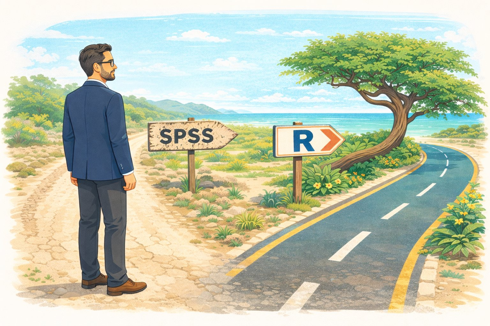

:::::::::::::::::::::::::::::::::::::: questions

- Why should I switch from SPSS to R?
- What can R do that SPSS cannot?
- How much does SPSS actually cost compared to R?

::::::::::::::::::::::::::::::::::::::::::::::::

::::::::::::::::::::::::::::::::::::: objectives

- Describe the practical advantages of R over SPSS for research
- See live examples of R capabilities that go beyond SPSS
- Understand the cost and reproducibility arguments for switching

::::::::::::::::::::::::::::::::::::::::::::::::

{alt="Cartoon of a researcher at a Caribbean crossroads choosing between a cracked SPSS path and a paved R path leading to the coast"}

## Introduction

This episode is a motivational opening. You will **not** write any code yourself
yet — sit back and watch the instructor demonstrate what R can do. By the end,
you should have a clear picture of *why* learning R is worth the investment of
your time.

### What you will see

The instructor will demonstrate four things that are impossible or impractical
in SPSS:

1. **Pulling a live research dataset** — the DCDC Network's small-island
   reference list, maintained on GitHub at the University of Aruba —
   straight into R, no browser required.
2. **Creating a publication-quality chart** in under 10 lines of code.
3. **A reproducible report** that updates automatically when new data arrives.
4. **An interactive dashboard** built entirely in R.

If any of those sound appealing, you are in the right place.

## The cost argument

Let us start with the most concrete reason. SPSS is expensive — especially for
small island institutions that pay per seat.

| | **SPSS Standard** | **R + RStudio** |
|---|---|---|
| License type | Annual subscription | Free, open-source |
| Cost per user per year | USD 1,170 – 5,730 (varies by tier) | USD 0 |
| 5-year cost for 5 users | USD 29,250 – 143,250 | USD 0 |
| Runs on | Windows, Mac | Windows, Mac, Linux, cloud |
| Updates | Paid upgrades | Continuous, free |

For a university department in the Dutch Caribbean with three SPSS licenses,
that is easily AWG 10,000+ per year that could be redirected to research
funding, student assistants, or conference travel.

::::::::::::::::::::::::::::::::::::: callout

## "But my institution already pays for SPSS"

That is true today. But institutional budgets change, and when you graduate or
change jobs, your personal SPSS license disappears. R stays with you forever —
on your laptop, on a cloud server, on a Raspberry Pi if you want. Your scripts
will still run in 10 years.

::::::::::::::::::::::::::::::::::::::::::::::::

## What R gives you that SPSS does not

### Reproducibility

In SPSS, a typical workflow looks like this: open a dataset, click through
menus, copy output into Word, repeat. If your supervisor asks "can you re-run
this with the updated data?", you have to remember every click.

In R, your entire analysis lives in a script. You change one line (the file
path) and re-run. Every step is documented.

### Packages

SPSS has a fixed set of procedures. R has over 20,000 add-on packages on CRAN
alone, covering everything from Bayesian statistics to text mining to
geographic mapping. If a method exists, there is probably an R package for it.

### Automation

Need to run the same analysis on 50 files? In SPSS, that means 50 times
through the menus (or learning SPSS syntax, which few people do). In R, it is
a three-line loop.

### Communication

R Markdown and Quarto let you combine narrative text, code, and output into a
single document — a PDF, a Word file, a website, or a slideshow. This lesson
itself was built with R.

### Career value

Data science job postings almost never list SPSS. R and Python dominate. Even
within academia, journals increasingly expect reproducible code alongside
submissions.

## Live demonstration

The instructor will now run a live demonstration. Watch the screen.

::::::::::::::::::::::::::::::::::::: callout

## What is happening on screen

Do not worry about understanding the code right now. The goal is to see what is
*possible*. You will learn the building blocks starting in the next episode.

::::::::::::::::::::::::::::::::::::::::::::::::

:::::::::::::::::::::::::::::::::::::::::::::::::::::::::::::::::::: instructor

## Live demo script

This is the complete script to run live. **Practice this before the workshop.**
Make sure `tidyverse` is installed — everything we need for the demo comes
with it.

### Step 1: Frame the source before you type

Before the first keystroke, name what the room is about to see. The CSV about
to load is in a GitHub repository maintained at the University of Aruba —
`island-research-reference-data` — part of the DCDC Network's shared
infrastructure for island research. It is not a third-party service you hope
stays up. It is research data the network owns and curates. That framing
matters: the "wow" is not just that R can read a URL. It is that the data
layer underneath belongs to us.

### Step 2: Pull the SIDS reference list

Open a new R script in RStudio and type (or paste) the following. Run it line
by line so participants can watch each step.

```{r, eval=FALSE}
# Load packages (install tidyverse once, before the workshop)
# install.packages("tidyverse")
library(tidyverse)

# Pull the UA island-research reference list straight from GitHub
countries <- read_csv(
  "https://raw.githubusercontent.com/University-of-Aruba/island-research-reference-data/main/countries/countries_reference_xlsform.csv"
)

# Quick look at what we got
head(countries)
```

Pause. Point out: "No browser. No download dialog. No save-as. The file is
now a live object in my session, with over a dozen columns per country."

### Step 3: Filter to SIDS and chart by region

```{r, eval=FALSE}
countries |>
  filter(is_sids == 1) |>
  count(wb_region) |>
  ggplot(aes(x = reorder(wb_region, n), y = n)) +
  geom_col(fill = "#44759e") +
  coord_flip() +
  labs(
    title = "Small island developing states by World Bank region",
    x = NULL,
    y = "Number of SIDS"
  ) +
  theme_minimal(base_size = 14)
```

Pause again. Key talking points:

- "This chart is ready for a report as-is. Title, axis labels, colour,
  proportions — all set in code."
- "If the UA team adds a country to the reference list tomorrow, I re-run
  this script and the chart updates. No re-click, no re-export."
- "Every editorial choice — what counts as a SIDS, which region goes where
  — is traceable, because the definitions sit in the source CSV you just
  pulled."

### Step 4: Show the contrast with SPSS

Ask the audience: "How would you have done this in SPSS?"

Walk through it slowly. Make it sting a little — this is the moment the cost
of the current workflow lands.

1. Go looking for a canonical SIDS list. UN-OHRLLS? UN DESA? A supplementary
   table from a recent paper? Pick one and hope it is current.
2. If you cannot find a clean download, email a colleague who might have one
   saved somewhere. Wait for a reply. Half a day, on a good day.
3. Open the CSV you eventually receive. Discover that "Cabo Verde" and
   "Cape Verde" are different strings, that some country codes are ISO-2
   and others ISO-3, that one row has a stray trailing comma. Clean by hand.
4. Import the cleaned file into SPSS. Recode the region variable because
   whatever classification the file uses does not match World Bank regions.
5. **Analyze > Descriptive Statistics > Frequencies** on region. Copy the
   output table.
6. **Graphs > Chart Builder**, drag variables, format the chart, copy,
   paste into Word.

Then say: "That is half a morning, on a good day, assuming the colleague
replies and the file is clean. In R it was six lines and ten seconds — from
a dataset the DCDC Network maintains, so the next person who needs it gets
the same clean answer."

### Backup plan

If the Wi-Fi is unreliable, the same CSV is saved locally at
`episodes/data/countries_backup.csv`. Swap the `read_csv()` call for the
local path:

```{r, eval=FALSE}
countries <- read_csv("data/countries_backup.csv")
```

Then proceed with the `filter() |> count() |> ggplot()` pipeline as normal.

::::::::::::::::::::::::::::::::::::::::::::::::::::::::::::::::::::::::::::::::

## Summary

You have now seen R:

- **Pull live data** from the internet with a single function call
- **Create a publication-ready chart** in 10 lines of code
- Do both of these things in a way that is **fully reproducible**

Starting in the next episode, you will learn to do these things yourself — one
step at a time.

::::::::::::::::::::::::::::::::::::: keypoints

- R is free, open-source, and runs on any operating system
- R scripts make your analysis fully reproducible
- R can pull data from APIs, create interactive visualizations, and automate reports — things SPSS cannot do
- Switching builds on your existing statistical knowledge, not replaces it

::::::::::::::::::::::::::::::::::::::::::::::::
