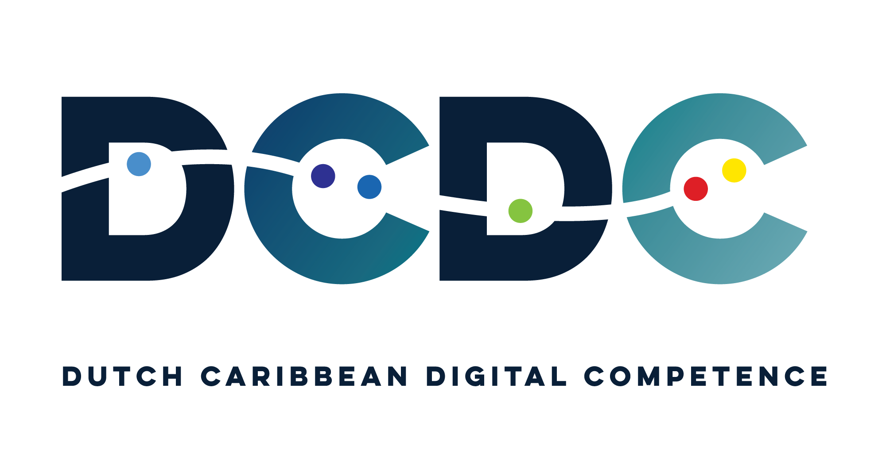

{alt='DCDC Network logo' width='300px'}

A hands-on workshop that builds on what you already know from SPSS to get you
productive in R. No programming experience required. By the end, you will be
running analyses, creating publication-quality visualizations, and working in a
fully reproducible workflow.

This course is developed by **Rendell de Kort** ([University of Aruba](https://www.ua.aw/) /
[DCDC Network](https://dcdc.network)) and is open and freely reusable under a
CC-BY 4.0 license.

## Who is this for?

This course is designed for anyone who currently uses SPSS and wants to
transition to a free, more powerful alternative. You do not need any programming
experience. If you understand basic statistical concepts like means, standard
deviations, and hypothesis testing, you have everything you need to start.

**Students**
: Using SPSS for coursework or thesis research and looking for a cost-free alternative

**Lecturers**
: Teaching research methods and interested in integrating open-source tools into courses

**Researchers**
: Seeking reproducible analysis workflows and better visualization capabilities

**Institutional analysts**
: Working with data in government, healthcare, or policy and paying for software licenses
